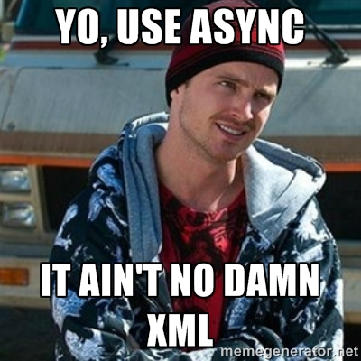

<!--

WARNING!! DON'T EDIT THE FILE README.md on the root of the project, that one is a GENERATED FILE!

You should just edit the source file at src/README.md - the one which stars with ## 10 tips for writing maintainable code in Backbone.js

-->

## 10 tips for writing maintainable code in Backbone.js

<br/><br/><br/><br/>

Tiago Garcia @ [Dancing with Marionette meetup](http://www.meetup.com/Dancing-with-Marionette-js/)

*http://tiagorg.com*

Jul 20th, 2015

---

## Tiago Garcia


- Tech Manager at [Avenue Code](http://www.avenuecode.com).
- Tech Lead at [Macys.com](http://www.macys.com).
- Organizer of the [Backbone.js Hackers meetup in SF](http://www.meetup.com/Backbone-js-Hackers).
- Gonna speak tomorrow at [DevCon5](http://www.html5report.com/conference/newyork/).
- [2nd overall article on AirPair writing contest](https://www.airpair.com/javascript/posts/the-mind-boggling-universe-of-javascript-modules).

---

## Agenda

1. Avoid jQuery Way
- Beware Memory leaks
- Don't Overwhelm
- Nest views right
- Control the Router
- Advocate Cohesion
- Eliminate Coupling
- Bind your data
- Componentize
- Mock your calls

---

## AJAX Rant

- Think twice before saying AJAX ever again.
- AJAX = *A*synchronous *J*avascript *A*nd *X*ML.
- AJAJ = *A*synchronous *J*avascript *A*nd *J*SON.
- Not because *XMLHttpRequest* -> it can transfer in any format.
- RESTful APIs became popular -> I don't see much XML around.
- XML lacks out-of-the-box support on MV* frameworks.
- However, *AJAJ* doesn't sound as cool as *AJAX* :(
- *ASYNC*, FTW! Who will join me?

----

## ASYNC



---

## #1: Avoid jQuery Way

- Backbone depends on jQuery\*, but *depending !== abusing*.
- Common mistake: adopting jQuery-based solutions instead of taking advantage of Backbone.js structures:
  - *Backbone.Model* takes care of data async calls so they **NEEDN'T** be coded like *`$.ajax()`*.
  - *Backbone.View* takes care of DOM events binding so they **NEEDN'T** be coded like *`$(el).click(...)`*.
- Simple to fix: just put Models and Views to do their work.
- Follow [Step by step from jQuery to Backbone](https://github.com/kjbekkelund/writings/blob/master/published/understanding-backbone.md) and rejoice.

---

## #2: Beware Memory leaks

- Backbone leaves much of the code structure for the developer to define and implement.
- Bad designs easily lead to memory leaks.
```javascript
  var MyView = Backbone.View.extend({
    initialize: function() {
      this.model && this.model.on('change', this.render, this);
    },
    render: function() {
      alert('Rendering the view');
    }
  });
```
- If *MyView* gets instantiated twice: 1st will never be Garbage Collected, as the model still refers to it -> *Zombie View*.
- This can cause *side effects* -> alert box will appear twice.

----

## Manual approach

- To fix it, we just need a method to *unbind* the View:
```javascript
    close: function() {
      // Unbind the events that this view is listening to
      this.stopListening();
    }
```
- However, we must remember to manually call this method whenever we destroy a *MyView* instance.
- Good practice: use a *Manager* to maintain the current View:
```javascript
    showView: function(view) {
      this.currentView && this.currentView.close();
      this.currentView = view;
      this.currentView.render();
      $('#content').html(this.currentView.el);
    }
```

----

## Marionette.js


<ul class="full">
  <li>A Backbone.js composite application library to <br/>provide structure for large-scale Javascript.</li>
  <li>Includes good practices and design & <br/>implementation patterns.</li>
  <li>Reduces code boilerplate.</li>
  <li>Provides a modular architecture framework <br/>with a Pub/Sub implementation.</li>
  <li>And much more...</li>
</ul>

----

## ItemView

- *Marionette.ItemView* extends *Backbone.View* and automates the rendering of a single item (Model or Collection).
- It implements *render()* for you, applying a given *template* to a Model/Collection.
- By using *listenTo()* instead of *on()* for binding events, you no longer need to manually invoke a *close* method.
```javascript
  var MyView = Marionette.ItemView.extend({
    template: '#my-ujs-template', // Underscore.js template
    initialize: function() {
      this.listenTo(this.model, 'change', this.render);
    }

    // No render() anymore!! :)
  });
```

----

## Region

- *Marionette.Region* is a Views container and manager.
- It properly displays Views on the DOM and disposes them -> no more Zombie Views.
```javascript
    var myRegion = new Marionette.Region({
      el: '#content'
    });

    var view1 = new MyView({ /* ... */ });
    myRegion.show(view1); // renders view1 and appends to #content

    var view2 = new MyView({ /* ... */ });
    myRegion.show(view2); // disposes view1, renders/append view2
```

---

## #3: Don't Overwhelm

- In a View which renders a Collection, we normally render a child View for each item and append them to the parent:
```javascript
  var CollectionView = Backbone.View.extend({
    render: function() {
      _.each(this.collection.models, function(item) {
        var view = new MyView({
          model: item
        });

        this.$el.append(view.render().el); // Populating the DOM
      }, this);
    }
  });
```
- Say the Collection has N items, this code will make N appends, which is *expensive*. What if N = 1000?


----

## Manual approach

- A better approach is to append to a *document fragment* instead, and just add the fragment *once* to the DOM:
```javascript
  var CollectionView = Backbone.View.extend({
    render: function() {
      var fragment = document.createDocumentFragment();

      _.each(this.collection.models, function(item) {
        var view = new MyView({
          model: item
        });

        fragment.appendChild(view.render().el); // Appending to fragment
      }, this);

      this.$el.html(fragment); // Populating the DOM
    }
  });
```

----

## CollectionView

- *Marionette.CollectionView* renders a Collection and uses a *Marionette.ItemView* for each item renderization. It doesn't need a template for itself.
- Uses a *document fragment* internally.
```javascript
  var MyView = Marionette.CollectionView.extend({
    itemView: MyView

    // No render() anymore!! :)
  });
```

----

## CompositeView

- *Marionette.CompositeView* is similar to a *Marionette.CollectionView* but also takes a template for itself. Designed for parent-child relationships.
- Useful to build hierarchical and recursive structures like *trees*.
```javascript
  var MyView = Marionette.CompositeView.extend({
    itemView: MyView,
    template: '#node-template', // Template for the parent
    itemViewContainer: 'tbody' // Where to put the itemView instances into

    // No render() anymore!! :)
  });
```

---

## #4: Nest views right

- Common view nesting:
```javascript
  var OuterView = Backbone.View.extend({
    render: function() {
      this.$el.append(template);

      // Inner view
      this.innerView = new InnerView();
      this.innerView.render();
      this.$('#some-container').append(this.innerView.$el);
    }
  });
```
- Every call to *render()* will instantiate again the inner view, and rebind the events.
- The previous inner views have potential to be Zombies.
- Inner view is manually created, but never manually disposed.

----

## Manual approach

- A better approach to improve performance & avoid Zombies.
```javascript
  var OuterView = Backbone.View.extend({
    initialize: function() {
      this.inner = new InnerView(); // Instantiated just once
    },

    render: function() {
      this.$el.append(template);
      this.$('#some-container').append(this.innerView.el);
      this.inner.render();
    },

    // Needs to be manually invoked before removing
    close: function() {
      this.inner.remove();
    }
  });
```

----

## Manual approach

- A better approach to improve performance & avoid Zombies.
```javascript
  var InnerView = Backbone.View.extend({
    render: function() {
      this.$el.html(template);

      // Needed to bind events to new DOM
      this.delegateEvents();
    }
  });
```
- This can easily get messy for multiple inner views.

----

## LayoutView

- *Marionette.LayoutView* extends from *Marionette.ItemView* but provides embedded *Marionette.Region*s which can be populated with other views.
```javascript
  var OuterView = Marionette.LayoutView.extend({
    template: '#outer-template',

    regions: {
      inner: '#inner-template'
    }
  });

  var outer = new OuterView();
  outer.render();

  var inner = new InnerView();
  outer.getRegion('inner').show(inner);
```

---

## #5: Control the Router

- Routers commonly violate the *Single Responsibility Principle* (SRP) when used to:
  - instantiate and manipulate views
  - load models and collections
  - coordinate modules
- A Router's main (and only) purpose is to define routes and delegate the flow to different parts of the application.
- According to MVC, *Controllers* should deal with such things as Models, Collections, Views and Modules.
- Even though Backbone.js is MV*, there is nothing wrong on creating Controllers just as any other module.

----

## Manual Approach

- One approach is to delegate the routes to controllers:
```javascript
  var MyRouter = Backbone.Router.extend({
    routes: {
      '': 'home',
      'home': 'home',
      'product/:id': 'viewProduct',
    },

    home: function() {
      myController.home();
    },

    viewProduct: function(productId) {
      myController.viewProduct(productId);
    }
  });
```

----

## AppRouter

- *Marionette.AppRouter* binds the route methods to an external *Controller* (plain JS object):
```javascript
  var MyRouter = new Marionette.AppRouter({
    controller: myController,
    appRoutes: {
      '': 'home',
      'home': 'home',
      'product/:id': 'viewProduct',
    }
  });
```
- Good practice: divide routes into smaller pieces of related functionality and have multiple routers / controllers, instead of just one giant router and controller.

---

## #6: Advocate Cohesion

- Backbone.js provides Models, Collections, Views and Routers, but we are not limited to these.
- Why should you write complex interface logic (full of customized components) on the same file?
- For a good separation of concerns, factor small pieces of related code into *cohesive Modules*:
```javascript
  // vehicleFactory.js
  modules.export = {
    createVehicle: function(wheels) {
      switch (wheels) {
        case 2: return new MotorcycleModel();
        case 4: return new CarModel();
        default: return new VehicleModel();
      }
    }
  };
```

---

## #7: Eliminate Coupling

- Components depending on other components usually create unnecessary *tight coupling*, which can be greatly reduced using a Pub/Sub:
```javascript
  var alerter = {         // should be a Subscriber
    sayIt: function() {
      alert('May the force be with you.');
    }
  };
  var invoker = {         // should be a Publisher
    start: function() {
      alerter.sayIt();    // hard dependency on alerter
    }
  };
  invoker.start();
```

----

## Backbone.Radio

- [Backbone.Radio](https://github.com/marionettejs/backbone.radio) implements a Pub/Sub:
```javascript
  // alerter.js
  var Radio = require('backbone.radio');
  Radio.channel('alerter').on('sayIt', function() {    // Subscriber
    alert('May the force be with you.');
  });
```
```javascript
  // invoker.js
  var Radio = require('backbone.radio');
  Backbone.Radio.channel('alerter').trigger('sayIt');  // Publisher
```
```javascript
  // main.js
  require('alerter');
  require('invoker');
```
- This is replacing *Backbone.Wreqr* on Marionette.js.

---

## #8: Bind your data

- Backbone.js data binding is primitive while other MV* frameworks (Ember.js, Knockout.js, AngularJS) excel on it.
- This code re-renders the whole View for each Model's change:
```javascript
  var MyView = Backbone.View.extend({
    initialize: function() {
      this.model && this.model.on('change', this.render, this); 
    },

    render: function() { ... }
  });
```
- Ideally, one attribute change on the Model should just re-render that attribute's representation on the DOM and not the whole View.

----

## Epoxy.js


- *Epoxy.js* is a data binding library for<br/>
Backbone.js based on Knockout.js<br/>
and Ember.js, featuring:
  - Declarative View Bindings
  - Automatic View Updates
  - Computed Model & View Attributes
- It connects each Model's attribute with a DOM element.
- Can be used together with Marionette's views.
- Can also compute results from the attributes's data.

----

## Epoxy.js

```html
  <!-- Plain HTML template -->
  <div id="my-form">
    <label>Name:</label>
    <input type="text" class="name">
    <span class="name"></span>
  </div>
```

```javascript
  var bindModel = new Backbone.Model({
    name: 'Lando Calrissian'
  });

  var BindingView = Backbone.Epoxy.View.extend({
    el: '#my-form',
    bindings: {
      'input.name': 'value:name,events:["keyup"]', // Input
      'span.name': 'text:name', // Output
    }
  });

  var view = new BindingView({ model: bindModel });
```

---

## #9: Componentize

- Views reusability for real? Think components.
- *Web Components* spec is right around the corner.
- *React* is a View framework about:

  - Components! (abstraction & composition)
  - Elements (DOM) vs. Templates (strings)
  - Virtual DOM 
  - Reactive data flow (or *ReactLink* for Two-way)
  - Bonus: works on the server-side!
- *React* can replace the whole *Backbone.View* layer.
- It just takes a mixin to be integrated with Backbone, or something as [react.backbone](https://github.com/clayallsopp/react.backbone).

----

## React.js

```javascript
  var bindModel = new Backbone.Model({
    name: 'Lando Calrissian'
  });

  var BindingView = React.createBackboneClass({
    render: function() {
      return (
        React.DOM.span( 
          { className: 'name' }, this.getModel().get('name')
        )
      );
    }
  });

  React.renderComponent(
    BindingView({ model: bindModel }), document.getElementById('my-form')
  );
```

----

## Benchmark

- <a href="http://jsfiddle.net/tiagorg/5L9qxnsq/" target="_blank">JSFiddle</a>
- Yes, structure and data binding have a price....
- ...so as the chaos of not having them!

---

## #10: Mock your calls

- How to unit test Models that consume data from a server?
- Using a real server can be slow. The server must also be up at all times, otherwise the tests will probably fail.
- Using *data mocks* frees us from server dependency. 
- However, it deviates from the way the Model will actually be used in Production, which creates challenges for testing.
- What about replacing the browser async mechanism with a *mock-powered proxy*?

----

## Sinon.JS


- Test spies, stubs and mocks for async.
- Framework-agnostic.
```javascript
  var server = sinon.fakeServer.create();
  server.autoRespond = true;

  server.respondWith(
    'GET',
    '/character/422',
    [
      200,
      { 'Content-Type': 'application/json' },
      JSON.stringify({
        'id': 422,
        'title': 'Lando Calrissian'
      })
    ]
  );
```
- Goes well with [Leche](https://github.com/box/leche) for mock creation.

---

## Learn more

1. [Structuring jQuery with Backbone.js](http://www.codemag.com/Article/1312061)
1. [Step by step from jQuery to Backbone](https://github.com/kjbekkelund/writings/blob/master/published/understanding-backbone.md)
1. [Zombies! RUN! (Managing Page Transitions In Backbone)](http://lostechies.com/derickbailey/2011/09/15/zombies-run-managing-page-transitions-in-backbone-apps/)
1. [Developing Backbone.js Applications](http://addyosmani.github.io/backbone-fundamentals)
1. [Marionette.js](https://github.com/marionettejs/backbone.marionette)
1. [Reducing Backbone Routers To Nothing More Than Configuration](http://lostechies.com/derickbailey/2012/01/02/reducing-backbone-routers-to-nothing-more-than-configuration/)
1. [Backbone.Radio](https://github.com/marionettejs/backbone.radio)
1. [Epoxy.js](http://epoxyjs.org)
1. [React](http://facebook.github.io/react/)
1. [Sinon.JS](http://sinonjs.org)
1. [Leche](https://github.com/box/leche)

---

## Marionette VDOM

- https://github.com/tiagorg/marionette-vdom
- https://www.npmjs.com/package/marionette-vdom
- A *Marionette.ItemView* and *Marionette.CompositeView* implementation with [virtual-dom](https://github.com/Matt-Esch/virtual-dom)
- Help is appreciated :)

---

# Thanks!

- Special thanks to Joanne Daudier and all you guys for the attention!
